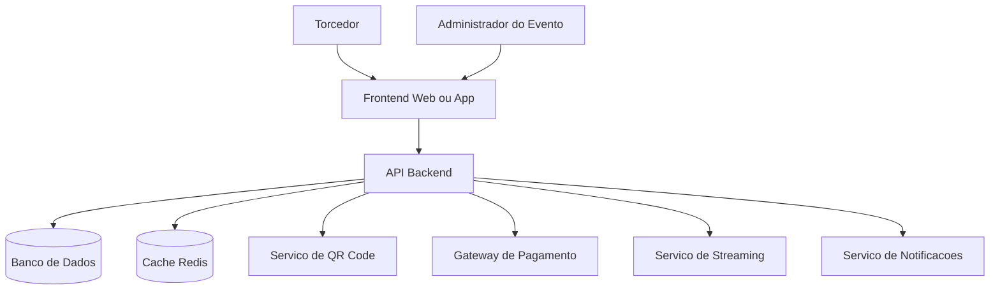
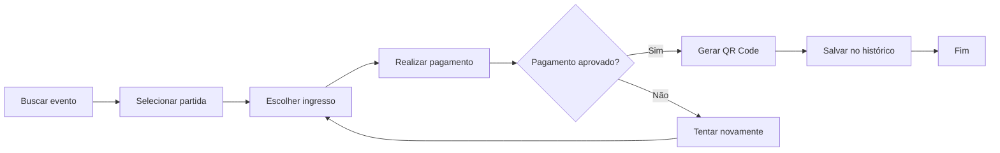
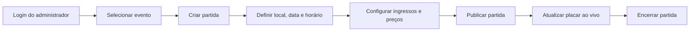
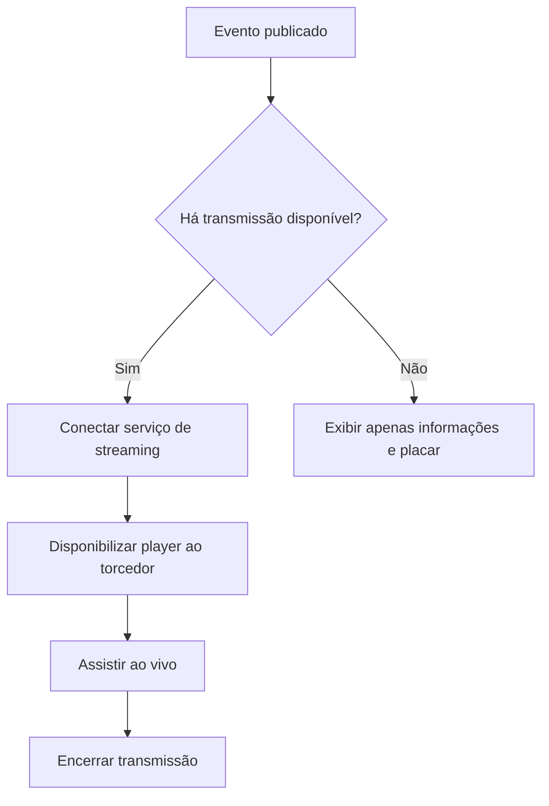
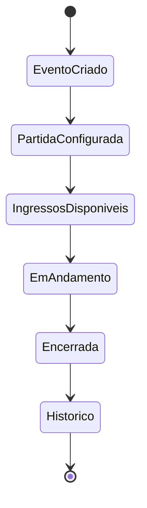

# Documento de Visão do Produto — ArenaStream

## 1. Visão Geral do Produto

### 1.1 Declaração do Problema e Oportunidade de Negócio

Torcedores frequentemente enfrentam dificuldades para acompanhar partidas esportivas de seus times favoritos em um único ambiente digital. Em muitos casos, a experiência está fragmentada entre diferentes canais: um aplicativo para compra de ingressos, outro para acompanhar resultados, redes sociais para notificações e plataformas separadas para transmissões ao vivo. Essa fragmentação prejudica a experiência do usuário, reduz o engajamento e dificulta a fidelização do público.

Do ponto de vista dos organizadores de eventos esportivos, também existem desafios relevantes. A gestão de partidas, a configuração de ingressos, o controle de vendas, a comunicação com o público e a disponibilização de informações em tempo real costumam depender de múltiplas ferramentas, o que aumenta a complexidade operacional e o risco de falhas.

Nesse cenário, surge a oportunidade de negócio para a **ArenaStream**, uma plataforma digital voltada à centralização da jornada do torcedor e à gestão operacional de eventos esportivos. O produto propõe reunir, em um único ecossistema, funcionalidades de descoberta de eventos, compra de ingressos, acompanhamento de placares em tempo real e transmissão ao vivo.

A oportunidade de mercado é reforçada pelo crescimento da digitalização no setor esportivo, pelo aumento do consumo de esportes via streaming, pelo uso crescente de múltiplas telas durante eventos e pela valorização de experiências personalizadas e conectadas para os fãs.

#### Problema principal
- Dificuldade de o torcedor encontrar, acompanhar e consumir eventos esportivos em um único ambiente.
- Complexidade para organizadores administrarem partidas, ingressos, comunicação e transmissões com eficiência.

#### Causas do problema
- Fragmentação das soluções disponíveis no mercado.
- Baixa integração entre venda de ingressos, atualização de placares e streaming.
- Necessidade de resposta rápida em períodos de pico de acesso.
- Dependência de múltiplos serviços e ferramentas isoladas por parte dos organizadores.

#### Oportunidade de negócio
- Criar uma plataforma centralizada para eventos esportivos.
- Melhorar a experiência do torcedor com conveniência, rapidez e personalização.
- Gerar receita por venda de ingressos, comissões, publicidade, assinaturas premium e parcerias com organizadores.
- Possibilitar expansão futura para modalidades diversas, campeonatos regionais, eventos universitários e competições amadoras.

#### Impacto potencial
- **Para torcedores:** experiência unificada, mais comodidade e acesso rápido a informações e conteúdo.
- **Para organizadores:** simplificação operacional, aumento de alcance e melhor gestão de vendas.
- **Para o mercado:** incentivo à digitalização de eventos esportivos de pequeno, médio e grande porte.
- **Para o negócio:** criação de um ecossistema escalável com múltiplas fontes de monetização.

---

### 1.2 Perspectiva do Produto

A **ArenaStream** será posicionada como uma plataforma web e mobile para centralização da experiência digital em eventos esportivos. O sistema se insere no contexto de transformação digital do setor esportivo, no qual clubes, federações, ligas e organizadores buscam novos meios de relacionamento com seus públicos, aumento de receita e eficiência operacional.

#### Contexto no ambiente atual
Atualmente, o ecossistema esportivo digital conta com soluções isoladas para:
- compra de ingressos;
- divulgação de eventos;
- estatísticas e placares;
- transmissão de vídeo;
- notificações e relacionamento com torcedores.

A ArenaStream se diferencia por unir essas capacidades em uma única plataforma, reduzindo a fragmentação da jornada do usuário e oferecendo uma solução integrada para consumo e gestão de eventos.

#### Público-alvo
- Torcedores de eventos esportivos.
- Organizadores de campeonatos e partidas.
- Clubes e federações esportivas.
- Empresas promotoras de eventos esportivos.
- Equipes operacionais responsáveis por check-in e validação de ingresso.
- Parceiros de transmissão e pagamento.

#### Proposta de valor
A ArenaStream entrega valor ao:
- facilitar o acesso do torcedor aos eventos esportivos;
- centralizar compra, acompanhamento e transmissão em um mesmo sistema;
- permitir gestão operacional eficiente por organizadores;
- aumentar o engajamento do público por meio de alertas, placar ao vivo e histórico de eventos;
- reduzir atritos na venda e validação de ingressos.

---

### 1.3 Capacidades do Produto

A plataforma ArenaStream oferecerá funcionalidades voltadas tanto aos torcedores quanto aos administradores dos eventos.

#### Principais funcionalidades

| ID | Funcionalidade | Descrição | Benefício Principal |
|---|---|---|---|
| CAP-01 | Cadastro de eventos esportivos | Permite que organizadores criem eventos na plataforma | Estruturação do catálogo de eventos |
| CAP-02 | Gerenciamento de partidas | Criação e edição de partidas com data, local e horário | Controle operacional do evento |
| CAP-03 | Configuração de ingressos | Definição de categorias, preços e lotes | Flexibilidade comercial |
| CAP-04 | Busca de eventos | Pesquisa por modalidade, data, time e localização | Facilidade para o torcedor encontrar eventos |
| CAP-05 | Compra online | Processo de compra digital de ingressos | Conveniência e escalabilidade |
| CAP-06 | Ingresso digital com QR Code | Geração de ingresso único para validação | Segurança e praticidade no acesso |
| CAP-07 | Placar ao vivo | Atualização em tempo real de resultados | Melhor experiência de acompanhamento |
| CAP-08 | Exibição do placar | Exibição instantânea do status da partida para usuários | Engajamento em tempo real |
| CAP-09 | Transmissão ao vivo | Integração com serviço de streaming | Ampliação da audiência |
| CAP-10 | Histórico do torcedor | Registro de compras e eventos assistidos | Retenção e personalização futura |
| CAP-11 | Alertas de favoritos | Notificações de partidas, placares e novidades | Maior engajamento |
| CAP-12 | Avaliação de eventos | Coleta de feedback dos torcedores | Melhoria contínua do serviço |

#### Requisitos funcionais consolidados

- **RF01**: O sistema deve permitir cadastrar eventos esportivos.
- **RF02**: O sistema deve permitir criar e gerenciar partidas dentro de um evento.
- **RF03**: O sistema deve permitir definir tipos de ingressos com preços diferentes.
- **RF04**: O sistema deve permitir buscar eventos por modalidade e data.
- **RF05**: O sistema deve permitir comprar ingressos online.
- **RF06**: O sistema deve gerar ingresso digital com QR Code.
- **RF07**: O sistema deve permitir atualizar placar em tempo real.
- **RF08**: O sistema deve mostrar o placar atualizado para os torcedores.
- **RF09**: O sistema deve permitir transmissões ao vivo de eventos.
- **RF10**: O sistema deve manter histórico de eventos e ingressos do torcedor.

#### Características de qualidade

- **Usabilidade:** interface simples, responsiva e intuitiva para usuários com diferentes níveis de familiaridade digital.
- **Segurança:** autenticação, autorização por perfil, proteção de dados pessoais, códigos únicos de ingresso e prevenção a fraudes.
- **Confiabilidade:** disponibilidade elevada em períodos de jogos e consistência nas operações de compra.
- **Desempenho:** resposta rápida na busca de eventos, atualização ágil do placar e estabilidade em picos de acesso.
- **Escalabilidade:** capacidade de suportar crescimento de usuários, eventos e acessos simultâneos.
- **Manutenibilidade:** arquitetura modular e integração com serviços externos desacoplados.

#### Requisitos não funcionais consolidados

- Estimativa de usuários: **5.000 a 20.000 usuários ativos por mês**.
- Volume estimado no primeiro ano: **~200 eventos** e **~50.000 ingressos vendidos**.
- Disponibilidade esperada: **alta**, especialmente durante eventos ao vivo.
- Segurança mínima: autenticação por login e senha, acesso segregado por organizador, código único por ingresso.
- Atualização quase em tempo real para módulos de placar e acompanhamento.

---

## 2. Diagramas

### 2.1 Diagrama de Arquitetura da Plataforma



### 2.2 Fluxo do Torcedor — Busca e Compra de Ingresso



### 2.3 Fluxo do Administrador — Gestão de Partida



### 2.4 Fluxo de Transmissão ao Vivo



### 2.5 Diagrama de Estados da Partida



---

## 3. Wireframes de Baixíssima Resolução

### 3.1 Fluxo do Torcedor — Busca e Compra

```text
+------------------------------------------------------+
| ArenaStream                                          |
| [Buscar por modalidade, time, data, cidade]          |
+------------------------------------------------------+
| Futebol     | Basquete    | Vôlei      | Futsal      |
+------------------------------------------------------+
| Evento: Final Regional                               |
| Data: 22/04/2026                                     |
| Local: Ginásio Central                               |
| [Ver detalhes] [Comprar ingresso]                    |
+------------------------------------------------------+
```

### 3.2 Tela de Detalhes do Evento

```text
+------------------------------------------------------+
| Final Regional - ArenaStream                         |
+------------------------------------------------------+
| Data: 22/04/2026                                     |
| Horário: 19:30                                       |
| Local: Ginásio Central                               |
| Placar ao vivo: Time A 1 x 0 Time B                  |
| Streaming: [Assistir ao vivo]                        |
+------------------------------------------------------+
| Ingressos                                            |
| - Arquibancada: R$ 40                                |
| - Premium: R$ 90                                     |
| [Comprar]                                            |
+------------------------------------------------------+
```

### 3.3 Painel do Administrador do Evento

```text
+------------------------------------------------------+
| Painel do Organizador                                |
+------------------------------------------------------+
| [Criar evento] [Criar partida] [Ingressos]           |
| [Placar ao vivo] [Transmissão] [Relatórios]          |
+------------------------------------------------------+
| Evento ativo: Copa Municipal                         |
| Partida: Time A x Time B                             |
| Placar: [1] x [0] [Atualizar]                        |
| Ingressos vendidos: 1.245                            |
+------------------------------------------------------+
```

---

## 4. Definição de Usuários

A definição de usuários a seguir segue a lógica de perfis descritos em padrões de especificação como a ISO/IEC/IEEE 29148:2011, organizando atributos relevantes para entendimento do público-alvo do sistema.

### 4.1 Perfil: Administrador do Evento

| Atributo | Descrição |
|---|---|
| Usuário ID | USER-001 |
| Nome do Perfil | Administrador do Evento |
| Descrição | Usuário responsável por cadastrar eventos, criar partidas, configurar ingressos, atualizar placares e acompanhar vendas |
| Experiência Técnica | Média |
| Frequência de Uso | Alta em períodos de organização e realização de eventos |
| Principais Objetivos | Gerenciar seu evento, organizar partidas, vender ingressos e acompanhar desempenho operacional |
| Desafios | Necessidade de atualização rápida de informações, controle de ingressos e estabilidade durante picos de acesso |
| Restrições | Só pode gerenciar eventos sob sua responsabilidade |
| Requisitos Principais | Painel administrativo, cadastro de partidas, atualização de placar, relatórios de vendas e gestão de transmissão |

### 4.2 Perfil: Torcedor

| Atributo | Descrição |
|---|---|
| Usuário ID | USER-002 |
| Nome do Perfil | Torcedor |
| Descrição | Usuário final que busca eventos, compra ingressos, acompanha placares e assiste transmissões |
| Experiência Técnica | Baixa a média |
| Frequência de Uso | Variável, conforme interesse em eventos e times |
| Principais Objetivos | Encontrar eventos, comprar ingressos com facilidade e acompanhar jogos em tempo real |
| Desafios | Encontrar eventos relevantes, receber informações atualizadas e concluir compras sem dificuldades |
| Restrições | Acessa somente seus ingressos e funcionalidades públicas |
| Requisitos Principais | Busca simples, checkout rápido, QR Code digital, alertas e histórico de participação |

### 4.3 Perfil: Operador de Check-in / Validador de Acesso

| Atributo | Descrição |
|---|---|
| Usuário ID | USER-003 |
| Nome do Perfil | Operador de Check-in |
| Descrição | Usuário responsável por validar os ingressos digitais no acesso ao evento |
| Experiência Técnica | Baixa a média |
| Frequência de Uso | Alta durante a entrada do público |
| Principais Objetivos | Validar ingressos rapidamente e evitar fraudes ou entradas duplicadas |
| Desafios | Necessidade de leitura rápida de QR Code e resposta imediata do sistema |
| Restrições | Acesso apenas ao módulo de validação vinculado ao evento |
| Requisitos Principais | Leitor de QR Code, consulta de status do ingresso, registro de entrada e usabilidade em dispositivos móveis |

### 4.4 Perfil: Parceiro de Transmissão / Operação de Conteúdo

| Atributo | Descrição |
|---|---|
| Usuário ID | USER-004 |
| Nome do Perfil | Operador de Transmissão |
| Descrição | Responsável por vincular ou monitorar a transmissão ao vivo do evento |
| Experiência Técnica | Média a alta |
| Frequência de Uso | Durante eventos com streaming habilitado |
| Principais Objetivos | Garantir que a transmissão esteja disponível e estável |
| Desafios | Dependência de serviços externos, latência e estabilidade do streaming |
| Restrições | Atua apenas nos eventos autorizados e no módulo de mídia |
| Requisitos Principais | Integração com serviço de streaming, monitoramento do status da transmissão e alertas de falha |

---

## 5. Restrições do Projeto e do Produto

As restrições a seguir são apresentadas em conformidade com a lógica de especificação adotada em documentos de requisitos e visão inspirados em padrões como IEEE 830.

### 5.1 Restrições Tecnológicas e de Projeto

| ID | Tipo | Descrição |
|---|---|---|
| RES-001 | Tecnologia | O sistema deve ser acessível por navegador web moderno e, preferencialmente, por dispositivos móveis |
| RES-002 | Tecnologia | O módulo de transmissão dependerá de integração com serviço externo especializado em streaming |
| RES-003 | Tecnologia | O processamento de pagamentos dependerá de gateway externo confiável |
| RES-004 | Desempenho | O sistema deve suportar picos de acesso durante o início e o decorrer de partidas relevantes |
| RES-005 | Consistência | O sistema deve impedir venda duplicada do mesmo ingresso |
| RES-006 | Segurança | Cada ingresso deve possuir identificador único e QR Code individual |
| RES-007 | Disponibilidade | O sistema deve apresentar alta disponibilidade em dias e horários de eventos |
| RES-008 | Escalabilidade | A arquitetura deve permitir crescimento gradual de usuários, eventos e transmissões |
| RES-009 | Recursos | O projeto deve considerar integração progressiva com serviços externos para reduzir complexidade inicial |
| RES-010 | Manutenção | O sistema deve ser modular para facilitar evolução futura |

### 5.2 Tecnologia e Padrões

#### Tecnologias sugeridas
- **Frontend:** React, Vue ou Angular para interface web responsiva.
- **Backend:** Java com Spring Boot, Node.js ou outra stack compatível com APIs REST e WebSocket.
- **Banco de dados:** PostgreSQL ou MySQL para dados transacionais.
- **Cache e tempo real:** Redis e WebSocket para atualização de placares e sessões.
- **Armazenamento de mídia e integrações:** uso de APIs externas para streaming e notificações.
- **QR Code:** biblioteca para geração e validação de códigos únicos.
- **Pagamentos:** integração com gateway como Mercado Pago, Stripe, PagSeguro ou similar.

#### Padrões e boas práticas
- API REST para operações transacionais.
- WebSocket ou tecnologia equivalente para atualização em tempo real.
- Autenticação e autorização baseada em papéis.
- Criptografia de dados sensíveis em trânsito.
- Registro de logs operacionais e de auditoria.
- Arquitetura orientada a serviços/módulos.
- Design responsivo com foco em acessibilidade e usabilidade.
- Especificação de perfis de usuário e requisitos alinhada a práticas de engenharia de software reconhecidas.

### 5.3 Legislação e Regulamentações

A ArenaStream deverá observar a legislação brasileira aplicável ao contexto de plataforma digital, comércio eletrônico, dados pessoais, ingressos e conteúdo audiovisual.

| ID | Norma / Regulamentação | Aplicação no Projeto |
|---|---|---|
| LEG-001 | **Lei nº 13.709/2018 (LGPD)** | Tratamento de dados pessoais de torcedores, organizadores e histórico de compras; necessidade de base legal, transparência e segurança |
| LEG-002 | **Lei nº 12.965/2014 (Marco Civil da Internet)** | Diretrizes para uso da internet, registros e responsabilidades da aplicação |
| LEG-003 | **Decreto nº 7.962/2013 (Comércio Eletrônico)** | Regras para contratação online, informação clara ao consumidor e atendimento facilitado |
| LEG-004 | **Lei nº 8.078/1990 (Código de Defesa do Consumidor)** | Relação de consumo na venda de ingressos e prestação de serviços digitais |
| LEG-005 | **Lei nº 12.933/2013 (Meia-entrada)** | Necessidade de contemplar políticas de meia-entrada quando aplicáveis |
| LEG-006 | **Lei nº 9.610/1998 (Direitos Autorais)** | Proteção e licenciamento de transmissões, imagens, audiovisual e demais conteúdos exibidos |
| LEG-007 | **Lei nº 14.597/2023 (Lei Geral do Esporte)** | Contexto regulatório geral do setor esportivo e organização da atividade esportiva no país |

#### Implicações regulatórias para a ArenaStream
- O sistema deverá exibir informações claras sobre preços, taxas, regras e condições de compra.
- O usuário deverá ser informado sobre o tratamento de seus dados pessoais e seus direitos.
- O armazenamento e o tratamento de dados devem adotar medidas de segurança compatíveis com a natureza das informações processadas.
- O processo de venda online deverá respeitar regras de transparência, confirmação e atendimento ao consumidor.
- A funcionalidade de transmissão ao vivo dependerá de direitos e autorizações apropriados para exibição do conteúdo.
- A política de ingressos deve contemplar, quando aplicável, categorias legalmente previstas de benefício.

---

## 6. Análise de Riscos e Mitigação

### 6.1 Matriz de Riscos

| ID do Risco | Descrição | Categoria | Probabilidade | Impacto | Ação de Mitigação | Plano de Contingência |
|---|---|---|---|---|---|---|
| RISCO-001 | Pico de acessos durante início de partidas importantes gerar lentidão ou indisponibilidade | Técnico / Externo | Alta | Alto | Uso de infraestrutura escalável, cache, balanceamento e monitoramento contínuo | Filas de espera virtuais, degradação controlada de funcionalidades não essenciais |
| RISCO-002 | Venda duplicada de ingressos em compras simultâneas | Técnico | Alta | Alto | Controle transacional, bloqueio de estoque, confirmação atômica de pagamento e reserva temporária | Estorno automático e realocação operacional em casos excepcionais |
| RISCO-003 | Atraso na atualização do placar ao vivo | Técnico | Média | Alto | Uso de WebSocket, infraestrutura de baixa latência e testes de carga | Exibir aviso de sincronização e fallback para atualização periódica |
| RISCO-004 | Falha no gateway de pagamento externo | Externo / Integração | Média | Alto | Integração com provedor confiável, logs detalhados e retentativas controladas | Disponibilizar método alternativo ou reprocessamento posterior |
| RISCO-005 | Instabilidade na transmissão ao vivo | Técnico / Externo | Alta | Alto | Uso de CDN/serviço especializado de streaming, monitoramento e redundância | Disponibilizar apenas o placar ao vivo e mensagens de indisponibilidade |
| RISCO-006 | Vazamento ou uso indevido de dados pessoais | Segurança / Legal | Média | Muito Alto | Controles de acesso, criptografia, política de privacidade, minimização de dados e boas práticas de segurança | Plano de resposta a incidentes, notificação às partes afetadas e adequação regulatória |
| RISCO-007 | Fraude em ingressos com QR Code copiado | Segurança | Média | Alto | Token único por ingresso, validação em tempo real e status de uso no check-in | Bloqueio do ingresso já utilizado e suporte presencial para análise |
| RISCO-008 | Erros operacionais por parte do organizador ao cadastrar partidas ou preços | Interno / Operacional | Média | Médio | Interface validada, confirmações, revisão antes da publicação e trilha de auditoria | Edição controlada e equipe de suporte administrativo |
| RISCO-009 | Baixa adesão inicial de organizadores | Negócio | Média | Alto | Estratégia comercial focada em eventos regionais e diferenciação por integração completa | Oferta de plano piloto, comissões reduzidas e onboarding assistido |
| RISCO-010 | Dependência excessiva de fornecedores externos de streaming e pagamentos | Externo / Estratégico | Média | Médio | Contratos com SLA e arquitetura desacoplada com abstração de provedores | Substituição planejada de fornecedor e operação em modo degradado |

### 6.2 Estratégia de Mitigação

A estratégia de mitigação da ArenaStream deve priorizar:
1. arquitetura escalável para suportar picos de acesso;
2. mecanismos transacionais fortes para venda de ingressos;
3. atualização em tempo real confiável para placares;
4. segurança de dados e conformidade regulatória desde a concepção;
5. observabilidade do sistema com logs, métricas e alertas;
6. dependência controlada de serviços externos com contratos e redundância.

---

## 7. Considerações Finais

A ArenaStream apresenta-se como uma solução com potencial para atender uma necessidade real do mercado esportivo digital: integrar descoberta de eventos, compra de ingressos, acompanhamento em tempo real e transmissão ao vivo em uma mesma plataforma.

Seu valor está na centralização da experiência do torcedor e na simplificação da operação para organizadores. Do ponto de vista técnico, o projeto demanda atenção especial à escalabilidade, à integridade das vendas, à atualização em tempo real e à conformidade com a legislação brasileira aplicável.

Ao considerar requisitos funcionais, requisitos não funcionais, perfis de usuários, restrições, riscos e regulamentações, este documento de visão fornece uma base consistente para orientar etapas posteriores do projeto, como levantamento detalhado de requisitos, modelagem, prototipação e definição arquitetural.
